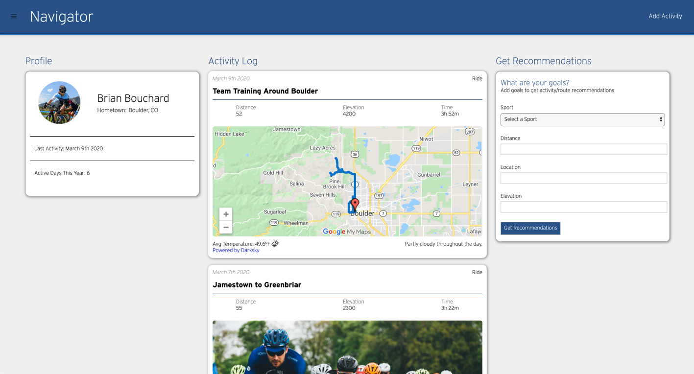

# Navigator

Navigator is a web application that allows athletes to track their activities and get recommendations based on user goals.



## Production Build

Visit: https://navigat.herokuapp.com

## Getting Started

### Prerequisites:

- NodeJS
- Mongo DB

#### Setup

1. Navigate to the preferred local directory where your project will reside.
2. Clone the following repository:
```
https://github.com/bee-squared/navigator.git
```
3. Navigate inside the root directory of the project './navigator/'
4. Create a .env file and set up the following variables:
-MONGODB_URI=mongodb://localhost/navigator
-REACT_APP_SERVER = localhost:[port of your choice]
-PORT=[port of your choice --> same port # as defined in the above REACT_APP_SERVER above]
-REACT_APP_PHOTOS=[link to your profile photo]
-REACT_APP_API_DARKSKY=[link to your darksky api license key]
-REACT_APP_API_GOOGLE=[link ro your google api license key]
5. Create a .gitignore file and include files you do not want to push to your public repo, such as:
-.env
-/node_modules
-/build
6. Run the following commands:
```
$ npm install
$ npm run server-dev
$ npm start
```

## Built With

- ReactJS
- React Router
- Sass
- Dotenv
- Node.js
- Express.js, Express Router
- Mongoose (MongoDB)
- Google Maps API
- Darksky Weather API

## Deployed Using
- [Heroku](https://www.heroku.com/home)

## Roadmap

### MVP (Completed)

- [x] Add new activities
- [x] Display activity stream
- [x] Show user profile
- [x] Get recommendations based on currently logged activities~~

### Version 1

- [ ] Edit a selected activity
- [ ] Delete a selected activity
- [ ] Responsive design updates

### Version 2

- [ ] Add basic charts of user's activities
- [ ] Allow users to create an account
- [ ] Add user profile image

### Version 3

- [ ] Upload images to activities

### Version 4

- [ ] Plan activities on a calendar
- [ ] Upload GPX files

### Version 5

- [ ] Schedule activity from recommendations
- [ ] Get recommendations based on crowd sourced routes
- [ ] Plan activities based on recommended routes

### Version 6

- [ ] Manage profile settings
- [ ] Manage settings page
- [ ] Create routes
- [ ] Show 5 day forecast

## Authors

Brian Bouchard
- [Github Profile](https://github.com/bee-squared)